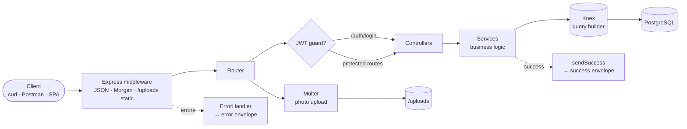
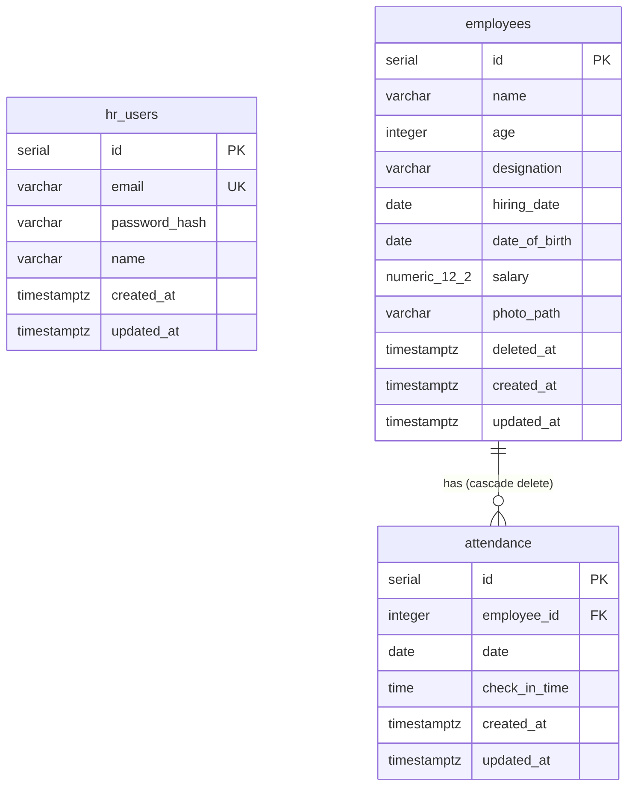

<div align="center">

# 🧑‍💼 HR Management API

**A production-grade HR Management REST API** — JWT authentication, employee CRUD with photo uploads,
attendance tracking with upsert semantics, and monthly attendance reporting.

*Express · TypeScript (strict, OOP) · Knex · PostgreSQL · Joi · Multer*


</div>

---

## 📑 Table of contents

- [✨ Overview](#-overview)
- [🏗️ Architecture](#-architecture)
- [🗄️ Database schema](#-database-schema)
- [🧰 Tech stack](#-tech-stack)
- [📁 Project structure](#-project-structure)
- [🚀 Quick start](#-quick-start)
- [⚙️ Configuration](#-configuration)
- [🔐 Authentication](#-authentication)
- [📌 API reference](#-api-reference)
- [📦 Response envelope](#-response-envelope)
- [🧪 Testing](#-testing)
- [📜 Scripts](#-scripts)
- [🛡️ Security & production notes](#-security--production-notes)
- [❓ Troubleshooting](#-troubleshooting)
- [📄 License](#-license)

---

## ✨ Overview

A small but production-minded HR backend. HR staff authenticate with email/password to receive a JWT,
then manage **employees** (with optional photo), record daily **attendance**, and pull a **monthly report**
showing days present and late arrivals (`check_in_time > 09:45:00`).

**Highlights**

- 🔐 JWT-protected routes (`/employees`, `/attendance`, `/reports`) via Express middleware
- 👤 Employee CRUD with pagination, ILIKE name search, **soft delete**, and **multipart photo upload**
- 🕒 Attendance **upsert** on `(employee_id, date)` — Postgres `ON CONFLICT`, concurrency-safe
- 📊 Monthly report: per-employee `days_present` + `times_late` via a single aggregated SQL query
- ✅ Strict TypeScript end-to-end, **Joi** validation, **no `any`** (enforced by ESLint)
- 🧱 Consistent JSON envelope + centralized error handling (no internals ever leaked)
- 🗄️ Knex **migrations & seeds**, connection pool sized from env
- 🧪 Jest unit tests + an end-to-end smoke suite (10/10 passing)

---

## 🏗️ Architecture

A layered Express app with manual OOP dependency wiring in `src/app.ts`
(**services → controllers → routes**). Business logic lives in services; controllers only parse the
request and send the response; validation/auth/errors are cross-cutting middleware.



**Request lifecycle** — request → body parsers → static files → router → (validation) → JWT guard →
controller → service → Knex → Postgres → response envelope. Any thrown error is normalized by the
centralized error handler into the standard error envelope.

---

## 🗄️ Database schema

Three tables with proper foreign keys, a unique constraint, and soft delete for employees.
Created via Knex migrations (`migrations/`).



- `attendance.employee_id` → `employees.id` **ON DELETE CASCADE**
- **UNIQUE `(employee_id, date)`** — one check-in per employee per day
- `employees.deleted_at` — soft delete; excluded from all list/search queries

---

## 🧰 Tech stack

| Concern            | Choice                                              |
| ------------------ | --------------------------------------------------- |
| Runtime            | Node.js ≥ 20, TypeScript 5 (strict, OOP)            |
| Web framework      | Express 4                                           |
| Query builder      | Knex 3 (`pg` driver)                                |
| Database           | PostgreSQL 12+                                      |
| Validation         | Joi                                                 |
| Auth               | `jsonwebtoken` + `bcryptjs`                         |
| Uploads            | Multer (local disk storage)                         |
| Config             | `.env` (`dotenv`) + Joi schema validation at boot   |
| Logging            | Morgan (HTTP) + a small leveled logger              |
| Tests              | Jest + ts-jest (unit) · Node `fetch` smoke (e2e)    |
| Lint / Format      | ESLint + Prettier (no `any` enforced)               |

---

## 📁 Project structure

```
hr-management-api/
├── src/
│   ├── server.ts              # bootstrap + graceful shutdown
│   ├── app.ts                 # Express app, middleware, DI wiring
│   ├── config/
│   │   ├── env.ts             # dotenv + Joi env validation → typed `env`
│   │   └── knex-config.ts     # shared Knex config (runtime + CLI)
│   ├── db/knex.ts             # Knex instance + pg type parsers
│   ├── types/
│   │   ├── index.ts           # row + response interfaces
│   │   └── express.d.ts       # augments Express Request with `user`
│   ├── errors/AppError.ts     # AppError + badRequest/notFound/unauthorized
│   ├── utils/                 # logger, response envelope, asyncHandler, time/date
│   ├── schemas/               # Joi schemas (auth, employee, attendance, report)
│   ├── middlewares/           # authenticate · validate · errorHandler · notFound
│   ├── upload/multer.ts       # configured Multer instance (disk storage)
│   ├── services/              # auth · employees · attendance · reports
│   ├── controllers/           # typed request handlers
│   └── routes/                # per-resource routers + index
├── migrations/                # Knex migration(s)
├── seeds/                     # Knex seed (admin + sample data)
├── scripts/smoke-test.cjs     # end-to-end smoke suite
├── knexfile.ts                # Knex CLI config
├── .env.example
└── package.json
```

**Conventions** — kebab-case files, PascalCase classes. Services/controllers are classes (OOP);
routes are functions that receive controller instances.

---

## 🚀 Quick start

```bash
# 1. Clone & install
git clone https://github.com/jewel80/hr-management-api.git
cd hr-management-api
npm install

# 2. Configure environment
cp .env.example .env        # then edit .env: set DB creds + a strong JWT_SECRET

# 3. Create the database (one-time)
psql -U postgres -c "CREATE DATABASE hr_management;"

# 4. Apply migrations & seed sample data
npm run db:migrate:latest
npm run db:seed

# 5. Run the server
npm run start:dev           # → http://localhost:3000
```

**Seed login:** `admin@example.com` / `Admin@12345`

---

## ⚙️ Configuration

All runtime config is read from `.env` (gitignored; see `.env.example`). Unknown variables are ignored;
critical ones (`DB_USERNAME`, `DB_NAME`, `JWT_SECRET`) are **required** and Joi-validated at boot —
the process exits early with a clear message if anything is missing/invalid.

| Variable            | Description                              | Default            |
| ------------------- | ---------------------------------------- | ------------------ |
| `NODE_ENV`          | `development` · `production` · `test`    | `development`      |
| `PORT`              | HTTP port                                | `3000`             |
| `APP_URL`           | Public base URL (used for photo URLs)    | `http://localhost:3000` |
| `LOG_LEVEL`         | `error` · `warn` · `info` · `debug`      | `info`             |
| `DB_HOST`           | Postgres host                            | `localhost`        |
| `DB_PORT`           | Postgres port                            | `5432`             |
| `DB_USERNAME`       | Postgres user **(required)**             | —                  |
| `DB_PASSWORD`       | Postgres password                        | `""`               |
| `DB_NAME`           | Postgres database **(required)**         | —                  |
| `DB_POOL_MIN`/`MAX` | Knex pool sizing                         | `2` / `10`         |
| `JWT_SECRET`        | JWT signing secret **(required, ≥16)**   | —                  |
| `JWT_EXPIRES_IN`    | Token lifetime (e.g. `1d`, `12h`)        | `1d`               |
| `UPLOAD_DIR`        | Local upload directory                   | `./uploads`        |
| `UPLOAD_MAX_BYTES`  | Max photo upload size                    | `5242880` (5 MB)   |

<details>
<summary><b>📄 Full <code>.env.example</code></b></summary>

```ini
NODE_ENV=development
PORT=3000
APP_URL=http://localhost:3000
LOG_LEVEL=info

DB_HOST=localhost
DB_PORT=5432
DB_USERNAME=postgres
DB_PASSWORD=postgres
DB_NAME=hr_management
DB_POOL_MIN=2
DB_POOL_MAX=10

JWT_SECRET=change-me-to-a-long-random-secret-value-min-16-chars
JWT_EXPIRES_IN=1d

UPLOAD_DIR=./uploads
UPLOAD_MAX_BYTES=5242880
```
</details>

---

## 🔐 Authentication

HR users authenticate with email/password to receive a JWT, then send it as a `Bearer` token on every
protected route. The decoded payload is attached to `req.user` (Express `Request` is augmented with a
typed `user` field).

```mermaid
sequenceDiagram
    autonumber
    Client->>API: POST /auth/login { email, password }
    API->>DB: find hr_user; bcrypt.compare(password, hash)
    DB-->>API: match
    API-->>Client: 200 { accessToken, tokenType, expiresIn, user }
    Client->>API: GET /employees  (Authorization: Bearer <accessToken>)
    API->>DB: SELECT employees WHERE deleted_at IS NULL
    DB-->>API: rows
    API-->>Client: 200 { success, data: { items, meta } }
```

Missing/invalid token → `401 Unauthorized`.

---

## 📌 API reference

Base URL: `http://localhost:3000` · All protected routes require `Authorization: Bearer <token>`.

### Auth

| Method | Endpoint        | Auth | Description                       |
| ------ | --------------- | ---- | --------------------------------- |
| `POST` | `/auth/login`   | ❌   | Validate credentials, return JWT. |

### Employees _(JWT required)_

| Method | Endpoint          | Description                                                       |
| ------ | ----------------- | ----------------------------------------------------------------- |
| `GET`  | `/employees`      | `page`, `limit`, `search` (ILIKE name). Excludes soft-deleted.    |
| `GET`  | `/employees/:id`  | Get one employee.                                                 |
| `POST` | `/employees`      | `multipart/form-data` create (optional `photo` part).            |
| `PUT`  | `/employees/:id`  | Update fields; include a `photo` part to replace the photo.       |
| `DELETE`| `/employees/:id` | Soft delete (sets `deleted_at`).                                  |

### Attendance _(JWT required)_

| Method | Endpoint           | Description                                                              |
| ------ | ------------------ | ----------------------------------------------------------------------- |
| `GET`  | `/attendance`      | `employee_id`, `from`, `to` (YYYY-MM-DD) + `page`/`limit`.              |
| `GET`  | `/attendance/:id`  | Get one record.                                                         |
| `POST` | `/attendance`      | **Upsert**: if `(employee_id, date)` exists → update `check_in_time`.   |
| `PUT`  | `/attendance/:id`  | Update a record.                                                        |
| `DELETE`| `/attendance/:id` | Delete a record.                                                        |

### Reports _(JWT required)_

| Method | Endpoint              | Description                                                              |
| ------ | --------------------- | ----------------------------------------------------------------------- |
| `GET`  | `/reports/attendance` | `month=YYYY-MM` (required) + optional `employee_id`. Per employee: `days_present`, `times_late` (late = `check_in_time > 09:45:00`). |

> **Field names are snake_case** to match the database: `employee_id`, `check_in_time`, `hiring_date`,
> `date_of_birth`, `days_present`, `times_late`, `photo_path`/`photo_url`. The login response uses
> `accessToken`/`tokenType`/`expiresIn` (JWT convention).
> `check_in_time` accepts `HH:mm` or `HH:mm:ss` (normalised to `HH:mm:ss` on write).

<details>
<summary><b>🧪 Example requests &amp; responses</b></summary>

**Login**

```bash
curl -X POST http://localhost:3000/auth/login \
  -H "Content-Type: application/json" \
  -d '{"email":"admin@example.com","password":"Admin@12345"}'
```
```json
{
  "success": true,
  "statusCode": 200,
  "timestamp": "2026-07-08T10:00:00.000Z",
  "data": {
    "accessToken": "eyJhbGciOi...",
    "tokenType": "Bearer",
    "expiresIn": "1d",
    "user": { "id": 1, "email": "admin@example.com", "name": "System Admin" }
  }
}
```

**Search employees**

```bash
curl "http://localhost:3000/employees?search=alice&page=1&limit=10" \
  -H "Authorization: Bearer <JWT>"
```
```json
{
  "success": true,
  "statusCode": 200,
  "timestamp": "2026-07-08T10:01:00.000Z",
  "data": {
    "items": [
      {
        "id": 1, "name": "Alice Johnson", "age": 30, "designation": "Software Engineer",
        "hiring_date": "2021-03-01", "date_of_birth": "1994-05-12", "salary": 85000,
        "photo_path": null, "photo_url": null,
        "created_at": "2026-07-08T09:00:00.000Z", "updated_at": "2026-07-08T09:00:00.000Z"
      }
    ],
    "meta": { "page": 1, "limit": 10, "total": 1, "totalPages": 1 }
  }
}
```

**Create employee with photo** (`multipart/form-data`)

```bash
curl -X POST http://localhost:3000/employees \
  -H "Authorization: Bearer <JWT>" \
  -F "name=Dana White" -F "age=29" -F "designation=Data Analyst" \
  -F "hiring_date=2023-02-01" -F "date_of_birth=1996-09-09" -F "salary=78000" \
  -F "photo=@/path/to/photo.jpg"
```

**Upsert attendance** (same `(employee_id, date)` → updates `check_in_time`)

```bash
curl -X POST http://localhost:3000/attendance \
  -H "Authorization: Bearer <JWT>" -H "Content-Type: application/json" \
  -d '{"employee_id":1,"date":"2026-07-08","check_in_time":"09:20"}'
```
```json
{ "success": true, "statusCode": 201, "timestamp": "...",
  "data": { "id": 7, "employee_id": 1, "date": "2026-07-08", "check_in_time": "09:20:00",
            "created_at": "...", "updated_at": "..." } }
```

**Monthly report**

```bash
curl "http://localhost:3000/reports/attendance?month=2026-07" -H "Authorization: Bearer <JWT>"
```
```json
{
  "success": true, "statusCode": 200, "timestamp": "...",
  "data": {
    "month": "2026-07", "employee_id": null,
    "items": [
      { "employee_id": 1, "name": "Alice Johnson", "days_present": 6, "times_late": 3 },
      { "employee_id": 2, "name": "Bob Smith",     "days_present": 6, "times_late": 3 },
      { "employee_id": 3, "name": "Carol Davis",   "days_present": 6, "times_late": 3 }
    ]
  }
}
```
</details>

---

## 📦 Response envelope

Every response uses one consistent shape.

**✅ Success** (added by `sendSuccess`):
```json
{ "success": true, "statusCode": 200, "timestamp": "ISO-8601", "data": { "..." } }
```

**❌ Error** (added by the centralized error handler):
```json
{
  "success": false,
  "statusCode": 400,
  "timestamp": "ISO-8601",
  "path": "/employees",
  "error": {
    "code": "BAD_REQUEST",
    "message": "Validation failed.",
    "fields": { "name": "\"name\" is required", "age": "\"age\" must be a number" }
  }
}
```

Common codes: `BAD_REQUEST` (400), `UNAUTHORIZED` (401), `NOT_FOUND` (404),
`PAYLOAD_TOO_LARGE` (413), `INTERNAL_SERVER_ERROR` (500). Unexpected errors return a generic 500 —
internal details are logged server-side but never exposed to clients.

---

## 🧪 Testing

**Unit tests** (Jest + ts-jest) cover the pure business logic — e.g. date/time normalization used by
the upsert and report logic:

```bash
npm test                 # run Jest
npm run test:cov         # with coverage
```

**End-to-end smoke test** (`scripts/smoke-test.cjs`) exercises the full stack against a running
server + seeded DB — auth, pagination/search, validation, the attendance upsert, multipart photo
upload, photo serving, and the report. Requires the server running:

```bash
npm run db:migrate:latest && npm run db:seed   # one terminal
npm run start:dev                              # another terminal
npm run test:smoke                             # then run the suite
```

<details>
<summary><b>📊 Smoke suite coverage (10 checks)</b></summary>

```
PASS GET /employees without token -> 401
PASS POST /auth/login -> 200 + token
PASS GET /employees -> items + meta
PASS GET /employees?search -> at least 1 match
PASS POST /employees invalid body -> 400 error envelope
PASS GET /reports/attendance -> report rows
PASS POST /attendance inserts + normalizes HH:mm -> HH:mm:ss
PASS POST /attendance upsert: same (employee,date) updates, no duplicate
PASS POST /employees multipart with photo -> photo_url
PASS GET /uploads/<file> serves the photo

RESULT pass=10 fail=0
```
</details>

---

## 📜 Scripts

| Script                       | Purpose                                            |
| ---------------------------- | -------------------------------------------------- |
| `npm run start:dev`          | Run in watch mode (`tsx watch`)                    |
| `npm run build`              | Compile to `./dist` (`tsc`)                        |
| `npm start`                  | Run the compiled build (`node dist/server.js`)     |
| `npm run lint` / `lint:check`| ESLint (`--fix`) / check-only                      |
| `npm test`                   | Jest unit tests                                    |
| `npm run test:cov`           | Jest with coverage                                 |
| `npm run test:smoke`         | End-to-end smoke suite (needs running server + DB) |
| `npm run db:migrate:latest`  | Apply Knex migrations                              |
| `npm run db:migrate:rollback`| Roll back the last migration batch                 |
| `npm run db:seed`            | Seed sample data (idempotent)                      |
| `npm run db:migrate:make -- <name>` | Create a new empty migration               |

---

## 🛡️ Security & production notes

<details>
<summary><b>View checklist</b></summary>

- **JWT secret** — use a long, random value (≥ 16 chars) in production.
- **Uploaded photos** are served at `/uploads/<filename>` (public; filename is a random UUID). For
  fully private media, serve behind an authenticated controller instead of `express.static`.
- **`bcryptjs`** is used instead of native `bcrypt` to avoid native build tooling (node-gyp) on
  Windows; swap in `bcrypt` for native performance if you have a build toolchain.
- **No `any`** anywhere — enforced as an ESLint **error**.
- **Errors** are logged server-side; unexpected errors return a generic 500 with no internal detail.
- **Soft delete** keeps employee history intact; rows are excluded from lists/search but retainable
  for audits.
- **Graceful shutdown** — `SIGINT`/`SIGTERM` close the HTTP server and destroy the Knex pool.
</details>

---

## ❓ Troubleshooting

<details>
<summary><b>Common issues</b></summary>

- **`Invalid environment configuration` at boot** — a required env var is missing/invalid. Check
  `.env` (`DB_USERNAME`, `DB_NAME`, `JWT_SECRET` are required).
- **`password authentication failed`** — `DB_PASSWORD` doesn't match your local Postgres user.
- **Migrations fail with `relation already exists`** — tables from a previous run conflict. Drop and
  recreate the database, then re-run `npm run db:migrate:latest`.
- **Photos return 404** — ensure `UPLOAD_DIR` resolves relative to the process working directory
  (default `./uploads`) and that the server has write access.
- **`401 Unauthorized` on protected routes** — the `Authorization: Bearer <token>` header is missing,
  malformed, or the token has expired; re-login.
</details>

---

## 📄 License

Released under the [MIT License](./LICENSE).
